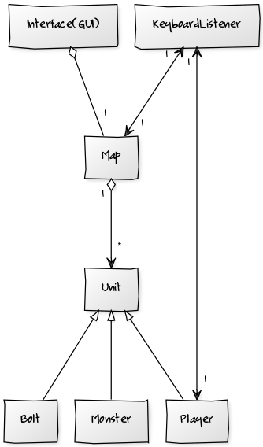
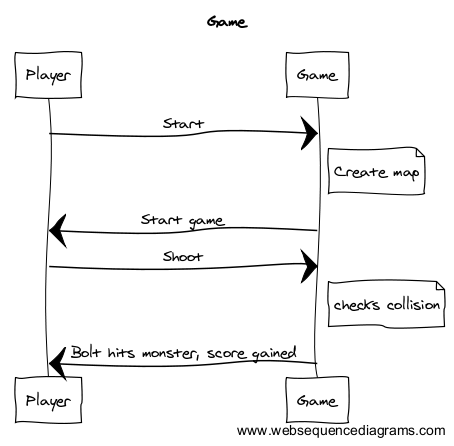
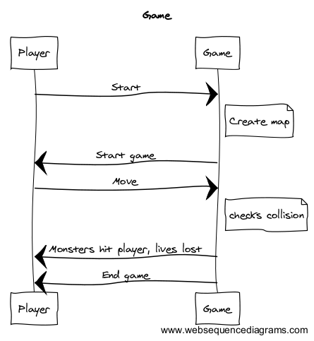

##**Aihe:**
2D peli. Toteutetaan peli, jonka tarkoituksena on päästä kenttä läpi osumatta vihollisiin. Peli on 2D, jossa pelaaja liikkuu sekä sivuttais- että pystysuunnassa, ja viholliset kohti pelaajaa. Pelaajan täytyy joko väistää tai ampua viholliset. Vihollisia ampumalla pelaaja kerää pisteitä. Viholliset jäävät ampumisen jälkeen kartalle, joka tekee pelistä jatkuvasti vaikeutuvan.

###**Kaikkien käyttäjien toiminnot**:
Kaikilla käyttäjillä samat toiminnot, eli pelin pelaaminen. Peli ei sisällä tallennusmahdollisuutta. Pelaaja liikkuu vasemmalle painaessaan vasenta nuolinäppäintä, ja oikealle painaessaan oikeaa nuolinäppäintä. Myös ylös ja alas liikutaan vastaavista nuolinäppäimistä. Välilyönnistä pelaaja ampuu ammuksen, jolla on tarkoitus osua viholliseen. 

###Luokkakaavio

###Sekvenssikaaviot

